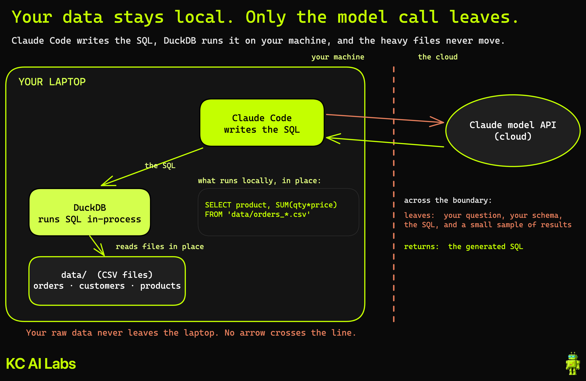

# Claude Code + DuckDB: Analyze Any CSV on Your Laptop

Query a folder of messy CSV files in plain English, with no warehouse to set up
and no database to connect to. You ask the question, an AI agent writes the
DuckDB SQL, and you read every line so you actually trust the answer.

This repo is the companion to the video on the
[Kyle Chalmers Data Plus AI](https://www.youtube.com/@kylechalmersdataai) channel.
It ships a small, realistic e-commerce dataset (orders split across monthly files,
plus customers and products) so you can follow along on your own machine.



## Why this exists

You have a CSV. Maybe a few. It is too big to open in Excel or it chokes pandas,
and you just want to ask it a question. The usual reflex is to stand up a cloud
warehouse, which means an account, a login, and a bill you did not want for a
single file.

DuckDB removes that step. It is an in-process analytical database (think SQLite,
but built for analytics) that queries CSV, Parquet, and JSON files directly on
your machine. There is no server to run and nothing to connect to. The file is
the table.

Pair it with Claude Code and you describe what you want in plain English. The
agent writes the SQL, runs it, and shows you both the query and the result. You
stay in control by reading the SQL, not by memorizing DuckDB's dialect first.

## Prerequisites

| Tool | Version | Purpose |
|---|---|---|
| [DuckDB CLI](https://duckdb.org) | 1.5.x | Runs the SQL locally against the CSV files |
| [Claude Code](https://claude.com/claude-code) | current | Writes and runs the SQL from plain-English prompts |
| Python 3 | 3.9+ | Only needed if you want to regenerate the sample data |

Installing the DuckDB CLI on a Mac is one line:

```bash
brew install duckdb
```

There is also an official [`duckdb-skills`](https://github.com/duckdb/duckdb-skills)
plugin for Claude Code if you prefer a packaged path. This repo uses plain Bash
plus the `duckdb` CLI because it is the most transparent way to work: you watch
every command.

## Setup

```bash
git clone https://github.com/kyle-chalmers/claude-code-duckdb.git
cd claude-code-duckdb

# the data/ folder is already committed, so you can query immediately:
duckdb -c "SELECT * FROM 'data/orders_2026_01.csv' LIMIT 5;"
```

To regenerate the dataset from scratch (deterministic, seeded):

```bash
python3 scripts/generate_data.py
```

## The data

Everything lives in `data/`. The files are split the way real exports often
arrive: one orders file per month, with customer and product details in separate
files you join back in.

| File | Columns | Notes |
|---|---|---|
| `orders_2026_01.csv` … `orders_2026_06.csv` | `order_id`, `order_date`, `customer_id`, `product_id`, `quantity`, `unit_price` | One file per month, January through June 2026 |
| `customers.csv` | `customer_id`, `customer_name`, `region` | Region is West, East, South, or Midwest |
| `products.csv` | `product_id`, `product_name`, `category` | Category is Electronics, Home, Apparel, or Outdoors |

Two things worth knowing:

- **Revenue is `quantity * unit_price`**, taken from the order row. A single
  monthly file is enough to rank products by revenue, no join required.
- `unit_price` is the price the customer paid, so it lives on the order.
  `products.csv` has no price column on purpose. Region and category only appear
  once you join `customers.csv` and `products.csv` back in.

## Try it yourself

The point is to ask in plain English and let the agent write the SQL. Open Claude
Code in this folder and try these, in order:

1. **"What were the top products by revenue in January?"**
   Reads `data/orders_2026_01.csv` directly. The file is the table, no import step.

2. **"Now answer that across every month, not just January."**
   Uses a glob, `FROM 'data/orders_*.csv'`, so the whole folder becomes one table.

3. **"Give me revenue by region and by product category."**
   Joins the orders glob to `customers.csv` and `products.csv` on `customer_id`
   and `product_id`, then groups and aggregates.

Read the SQL it writes each time. A query can run clean and still be wrong (a
dropped filter, the wrong grain, or summing `unit_price` without multiplying by
`quantity`). Reading the SQL is how you catch that, and it is also how you pick up
DuckDB's dialect without studying it.

## The honest boundary

Your raw data stays on your laptop. What leaves is the question you typed, your
schema, the SQL the agent writes, and a small sample of results, all sent to the
model API. So it is cheap, but it is not free, and it is not fully private. If you
need fully offline, point the agent at a local model and trade some quality to
keep everything on your machine.

This earns a permanent spot for the everyday question you would otherwise spin up
a warehouse for. It is for your own local exploration, not a whole team writing
production dashboards against the same data at once. That stays warehouse
territory, and DuckDB is single-writer by design.

## Project structure

```
claude-code-duckdb/
├── data/                     # the sample CSVs (committed, query these directly)
│   ├── orders_2026_01.csv    # one orders file per month, Jan–Jun 2026
│   │   …
│   ├── orders_2026_06.csv
│   ├── customers.csv
│   └── products.csv
├── scripts/
│   └── generate_data.py      # seeded generator that rebuilds data/
├── images/
│   └── diagram.png           # how the pieces fit together
├── CLAUDE.md                 # context for the AI agent
└── README.md
```

## Resources

- DuckDB: https://duckdb.org
- DuckDB concurrency (the single-writer boundary): https://duckdb.org/docs/stable/connect/concurrency
- `duckdb-skills` (official Claude Code plugin): https://github.com/duckdb/duckdb-skills
- Claude Code: https://claude.com/claude-code

## About

Built for the [Kyle Chalmers Data Plus AI](https://www.youtube.com/@kylechalmersdataai)
channel, where I show how to use AI tools for real data work. The follow-up takes
this same setup to the cloud with MotherDuck for when the data outgrows your
laptop.
